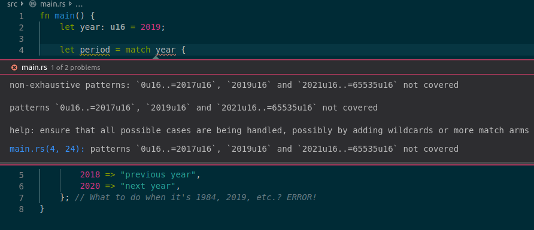

## A minimal program

```rust
fn main() {
    println!("Hello world!");
}
```

## Printing things

```rust
fn main() {
    println!("It is {} of {}.", "August", 2019); // first argument defines a "template" with placeholders

    // Some types can not be printed with the default `{}` placeholder.
    // You may need to use `{:?}` ("Debug") placeholder
    println!("{:?}", [1, 2, 3]);
}
```

## Variables

```rust
fn main() {
    let a = 2; // You do not have to specify types, Rust compiler infers them.
    let b: u64 = 2; // But you can specify them explicitly if you want!
    let sum = a + b;
    println!("{}", sum);
}
```

Variables are immutable by default!
To allow mutation, use `let mut` instead of `let`.

```rust
fn main() {
    let year = 2019;
    year += 1; // ERROR!

    let mut score = 9;
    score += 1; // this is fine!

    println!("Year {}: I would rate my knowledge of rust {}/10", year, score);
}
```

The compiler will often helpfully suggest a fix to your code.


Basic types:
* `i8`, `i16`, `i32`, `i64` - signed integers of 8, ..., 64 bits
  (think `int`, `long`, but with an explicitly defined size).
* `u8`, `u16`, `u32`, `u64` - unsigned integers of 8, ..., 64 bits
  (think `unsigned int`, `unsigned long`).
* `f32`, `f64` - floating point types, equivalent to `float` and `double` respectively.
* `bool`
* `()` - usually pronounced "unit". Represents "nothing", an empty tuple.
  Similar to `void` in C, but more powerful.
* `&str` or `String` - both represent strings (text). If in doubt:
  * Use `&str` (pronounced "string slice") for function parameters:
    * `&String` will "magically" convert into `&str` when passing to functions, etc.
    * A string literal like `"John Smith"` is a `&str`, not a `String`.
  * Use `String` for most other cases.
* `char` - a unicode codepoint, e.g. `'A'`, `'Ž'` `'錆'` or even. `'👌'` (yep!).
  Not a single byte like in C.

## Functions

```rust
/// A function that returns nothing
fn greeting1() {
    println!("Hello world!");
}

/// Equivalent to greeting2, explicitly specified to return a unit.
fn greeting2() -> () {
    println!("Hello world!");
}

/// Accepts a single argument
fn make_greeting1(first_name: &str) -> String {
    return format!("Hello, {}", first_name); // Like println, but returns a String instead of printing it out
}

/// Accepts two arguments
fn make_greeting2(first_name: &str, age: u64) -> String {
    // "return" is optional: if you write an expression
    // without terminating it with a semi-colon,
    // it is returned!
    format!("Hello, {} who is aged {}", first_name, age)
}

fn main() {
    greeting1();
    greeting2();
    println!("{}", make_greeting1("Justinas"));
    println!("{}", make_greeting2("Justinas", 24));
}
```

## Loops

```rust
// Exclusive range [0, 10)
for i in 0..10 {
    println!("{}", i);
}

// Inclusive range [0, 10]
for i in 0..=10 {
    println!("{}", i);
}

// "while" is also supported!
let mut i = 0;
while i < 10 {
    println!("{}", i);
}

// Loop forever (like "while true").
// Run at your own risk!
loop {
    println!("Hello!");
}
```

## Conditionals

```rust
let year = 2019;

if year < 1900 {
    println!("19th century");
} else if year < 2000 {
    println!("20th century");
} else {
    println!("not so long ago!");
}
```

In Rust, "everything is an expression"!
Even an if statement can be treated as something that returns a value.

```rust
let year = 2019;

let period = if year < 1900 {
    "19th century" // again: no semicolon means return this value
} else if year < 2000 {
    "20th century"
} else {
    "not so long ago!"
}; // but this semicolon is now required - we are doing an assignment

println!("{}, that's {}", year, period);
```

Implicit returns and if being an expression
makes writing a `min` function really quick.

```rust
fn min(a: u64, b: u64) -> u64 {
    if a < b {
        a
    } else {
        b
    }
}
```

## Pattern matching

`match` is like `if`, but more powerful!
We'll need its advanced functionality later.

```rust
let year: u64 = 2019;

let period = match year {
    // You can use "ranges" like in a for loop
    0..1900 => "a long time ago",
    1900..2000 => "20th century",
    2000..2019 => "not so long ago",

    // Or a constant
    2019 => "current year",

    // _ means anything else.
    _ =>  "sometime in the future",
}
```

Rust compiler ensures that we handle every possible case in a `match`.
This is an error:

```rust
let year: u16 = 2019;

let period = match year {
    2018 => "previous year",
    2020 => "next year",
}; // What to do when it's 1984, 2019, etc.? ERROR!
```



Human-speak:

> Type u16 can hold values from 0 to 65535,
> but you haven't defined what to do
> for range [0, 2017], value 2019, or range [2021, 65535]!

You will often need an `_` pattern to "ignore any other case"
or give it a default value.
