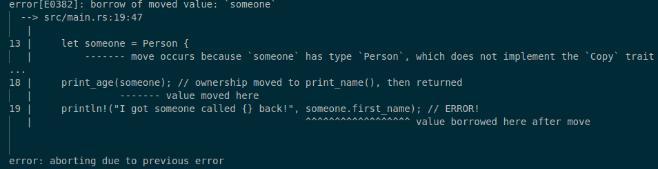

# Move semantics & borrowing

## Passing structures around

Everything but the most primitive types (integers, booleans, etc.)
operate under *move semantics* in Rust. 

That means the value has a single "owner"
and if the value is passed somewhere else (e.g. into a function),
the ownership is transferred. The original owner then is not able to access the value anymore.

```rust
struct Person {
    first_name: String,
    age: u16,
}

fn print_age(person: Person) {
    println!("I got someone aged {}", person.age);
}

fn main() {
    let someone = Person {
        first_name: String::from("Justinas"),
        age: 24,
    };
    println!("I have someone called {}", someone.first_name);
    print_age(someone); // ownership moved to print_name()
    println!("I still have someone called {}", someone.first_name); // ERROR!
}
```



### Solution 0: Copy semantics

Some very simple types (e.g. comprised of only integers, booleans, etc.)
can be made `Copy`.

That is, like these primitive types, it is implicitly copied when passed to functions.

```rust
// A special directive to the compiler:
// do not move ownership of this
// but copy when passed around.
#[derive(Copy)]
struct Coordinates {
    x: i64,
    y: i64,
}
```

However, this does not work for types
that include values that are not `Copy` themselves.

E.g., `String` is not a `Copy` type, so this does not work for our `Person`.

### Solution 1: pass ownership... and then return it

```rust
struct Person {
    first_name: String,
    age: u16,
}

/// Receive a person, print their age, return that same person back
fn print_age(person: Person) -> Person {
    println!("I got someone aged {}", person.age);
    person // remember, an expresion without a semi-colon returns!
}

fn main() {
    let someone = Person {
        first_name: String::from("Justinas"),
        age: 24,
    };
    println!("I have someone called {}", someone.first_name);
    let someone2 = print_age(someone);
    println!("I got someone called {} back!", someone2.first_name);
}
```

### Solution 2: Clone

```rust
// A special directive to the compiler that says:
// make this type have a `clone()` method,
// that makes a clone of it by cloning each field.
#[derive(Clone)]
struct Person {
    first_name: String,
    age: u16,
}

fn print_age(person: Person) {
    println!("I got someone aged {}", person.age);
}

fn main() {
    let someone = Person {
        first_name: String::from("Justinas"),
        age: 24,
    };

    println!("I have someone called {}", someone.first_name);
    print_age(someone.clone()); // Pass a CLONE of someone, leaving the original person untouched!
    println!("I still have someone called {}", someone.first_name);
}
```

### Solution 3: Borrowing

This is the solution that is correct in most of the cases.
`&` indicates an *immutable* or a shared reference.

Whoever you give this reference to
has a read-only access to the object for a limited time.

```rust
struct Person {
    first_name: String,
    age: u16,
}

fn print_age(person: &Person) {
    println!("I got someone aged {}", person.age);
}

fn main() {
    let someone = Person {
        first_name: String::from("Justinas"),
        age: 24,
    };

    print_age(&someone);
    print_age(&someone);
}
```


`&mut` indicates a *mutable* reference.
Whoever you give this reference to
has a read/write access to the object for a limited time.
No other `&` (immutable) or `&mut` (mutable)
references can be held to that object at the same time.

```rust
struct Person {
    first_name: String,
    age: u16,
}

fn print_age(person: &Person) {
    println!("I got someone aged {}", person.age);
}

fn set_age(person: &mut Person, age: u16) {
    person.age = age;
}

fn main() {
    // &mut can only be taken from a `mut` variable
    let mut someone = Person {
        first_name: String::from("Justinas"),
        age: 24,
    };

    print_age(&someone);
    set_age(&mut someone, 25);
    print_age(&someone);
}
```

