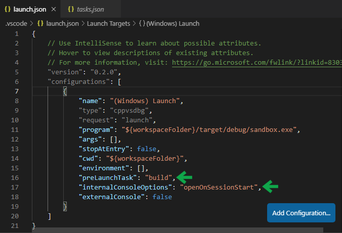

# Setting up for Rust development on Windows 10

## Install Rust

1. Download and install
  [Build Tools for Visual Studio 2019](https://visualstudio.microsoft.com/downloads/#build-tools-for-visual-studio-2019).
  Make sure to check the "C++ build tools" option.
  This may take a while.
2. Download and run [rustup-init.exe](https://rustup.rs/).
   No need to modify the default options, just press ENTER when asked.
3. Open up PowerShell and test it out by issuing the commands:

```
cargo new sandbox # make a new Cargo project named "sandbox"
cd sandbox        # enter its folder
cargo run         # build and run your project!
```

## Install Visual Studio Code and configure it for Rust

1. Download and install [Visual Studio Code](https://code.visualstudio.com/Download). System Installer, 64-bit is recommended.
2. Launch VS Code. We will now install the required extensions.
   In the left sidebar, choose "Extensions" (the bottom menu entry).
    1. Search for "Rust (rls)" (by rust-lang) and install it.
    2. Search for "C/C++" (by Microsoft) and install it.
3. Go to File -> Preferences -> Settings.
   Search for a setting called "Allow Breakpoints Everywhere"
   and check it.

## Configure Visual Studio Code for your Rust project

Sadly, this part is a bit involved
and you have to repeat it each time
you create a new project.

However, after doing it once, 
you can simply copy over the `.vscode` folder
for each new project
then just change the name of your `.exe`
in `.vscode/launch.json`
and it should work.

1. Relaunch VS Code. Open your project folder
   (e.g. `C:\Users\Justinas\sandbox`).
   Open `src/main.rs`.
   If it's the first time, you might get a notification
   asking if you'd like to install RLS (Rust Language Server). Choose "Yes".
2. Press Ctrl+Shift+P to open the command bar.
   Search for "Configure Default Build Task" and choose it,
   then choose "Rust: cargo build".
3. A file called `.vscode/tasks.json` will open.
   Add a configuration parameter `"label": "build"` in the task specification. We will need this later.
   
   
4. Press F5 (this tries to run the program).
   However, since this is the first time, it will ask us to make a configuration. Choose "C++ (Windows)".
5. A file called ".vscode/launch.json" will open.
   1. Change the key `"program"` to have the value of `"${workspaceFolder}/target/debug/sandbox.exe"` (replace "sandbox" with your project name if you named it differently).
   2. Add a key `"preLaunchTask": "build"`. This will make sure our program is recompiled before starting it.
   3. Add a key `"internalConsoleOptions": "openOnSessionStart"`.
      This will make sure our debug console is focused when we run the program.
   
6. Press F5 to run the program!
